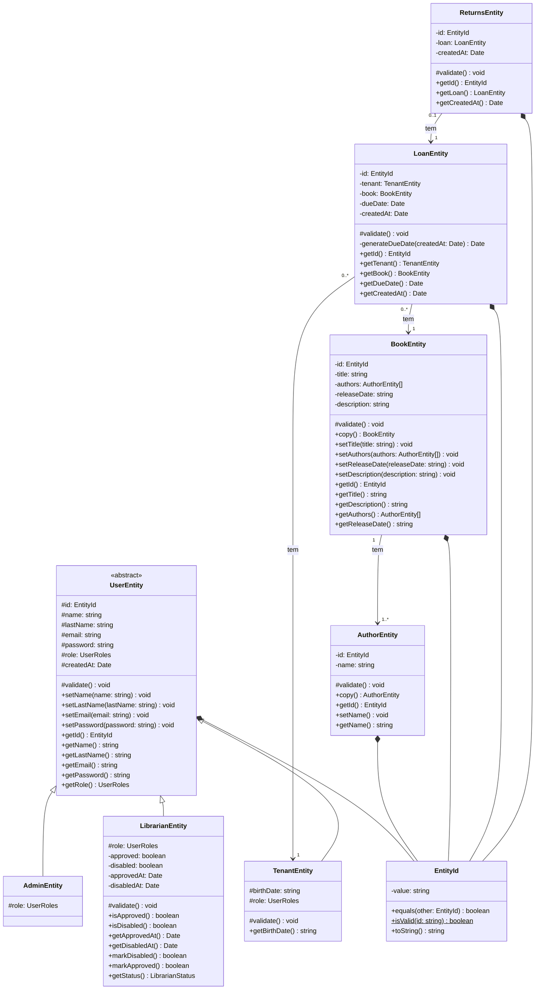

# Descrição

- Librum é um sistema simples de uma biblioteca. Ele tem como objetivo resolver alguns dos problemas existentes, como o gerenciamento de usuários (aluno, bibliotecário e admin), gerenciamento de empréstimos e devoluções, criação e listagem dos livros existentes e etc.

# Como rodar o projeto

## Instalar as dependências

```bash
$ yarn install
```

### Docker

Para rodar o projeto utilizando o docker, basta executar os seguintes comandos:

```bash
docker compose up -d --build
```

Caso tenha o task instalado, uma outra maneira de iniciar o projeto também utilizando o docker é através do comando:

```bash
task
```

Por baixo dos panos, ele vai estar executando o comando anterior relacionado ao docker.

### Sem docker

```bash
yarn start:dev
```

# Funcionalidades

- Criar usuário
  - Locatario
  - Bibliotecário
- Logar no sistema como:
  - Locatário
  - Bibliotecário
  - Admin
- Cadastrar
  - Autor
  - Livro
- Listagem paginadas
  - Livros
  - Autores
  - Empréstimos
  - Devoluções
  - Bibliotecários cadastrados
- Buscar entidades relacionadas ao usuário logado
  - Empréstimos
  - Devoluções
- Aprovar criação de conta de bibliotecário
- Desativar conta de bibliotecário

# Para testar o projeto

Por conta do Swagger, fica mais fácil testar o projeto. Todas as rotas estão documentadas contendo entradas válidas e etc. Para acessar essa documentação, abra seu navegador e procure por:

```
http://localhost:3000/api/docs
```

# Diagrama UML

O diagrama abaixo é mais focado nas entidades do sistema. Existem inúmeras classes, portanto, apenas nos atentamos as entidades.

## Entidades


